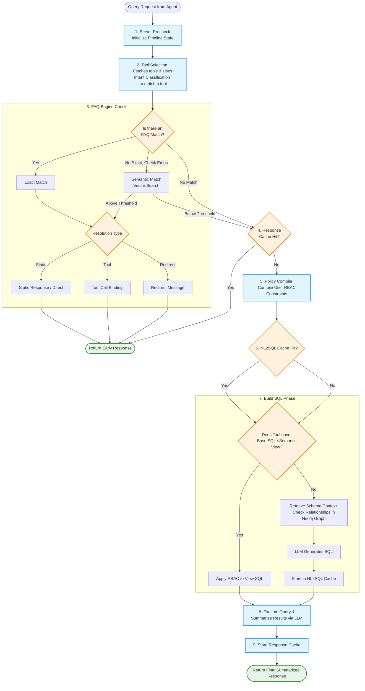

# Query Flow Diagram

This flow diagram illustrates the step-by-step process of how a query (question) from an AI Agent is handled by the backend pipeline (`query_pipeline`).

## Detailed Flow Correction

Based on the actual pipeline execution (`src/retrieval/pipeline/pipeline_orchestrator.py`), here is the verified order of execution:

1. **Server Precheck**: Initializes the pipeline state.
2. **Tool Selection / Intent Classification**: Fetches available tools and selects the best one using intent classification.
3. **FAQ Engine**:
   - Tries for an **Exact Match** or a **Semantic Match** via embeddings.
   - If a match is found, it evaluates the resolution type:
     - **a. Direct (Static Response)**
     - **b. Tool Call Binding** (Executes a specific tool)
     - **c. Redirect**
   - *Short circuits (returns response)* if an FAQ resolves the question.
4. **Response Cache Check**: Looks to see if this exact query already has a stored and fully summarized response. *Short circuits* if found.
5. **RBAC Policy Compile**: Compiles data-access constraints specific to the user.
6. **NL2SQL Cache Check**: Looks for a cached SQL template to skip LLM generation later.
7. **Build SQL**: 
   - Checks if the selected tool already has predefined SQL (like a Semantic View). If so, it applies the RBAC policies to that SQL.
   - If no predefined SQL or NL2SQL cache exists, it **checks for Relationships in the Graph** (Retrieves schema context) and asks the LLM to generate the SQL.
   - It caches the generated SQL back into the NL2SQL cache.
8. **Execute & Summarize**: Runs the finalized SQL query securely and uses the LLM to generate a natural language summary from the raw data rows.
9. **Store Response Cache**: Caches the final generated response for future matching.
